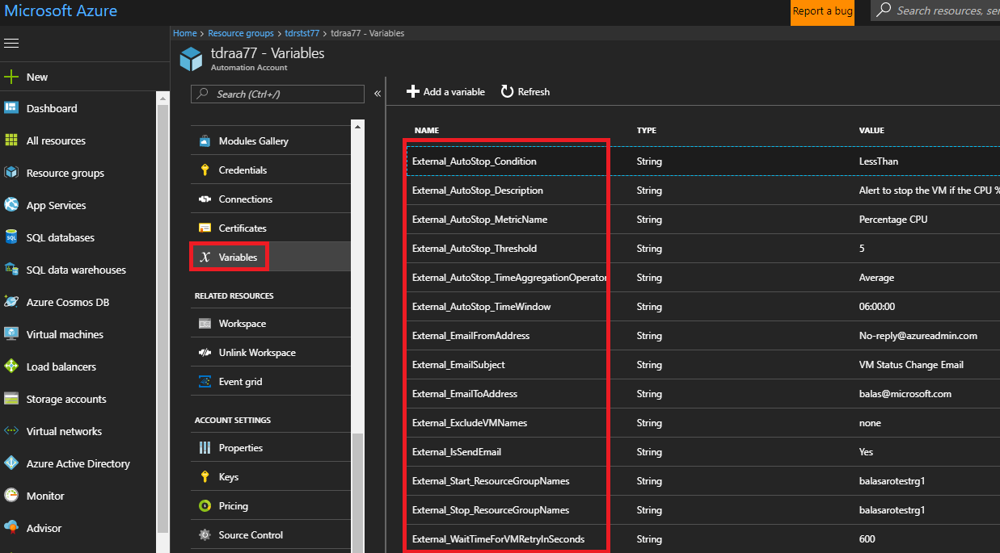
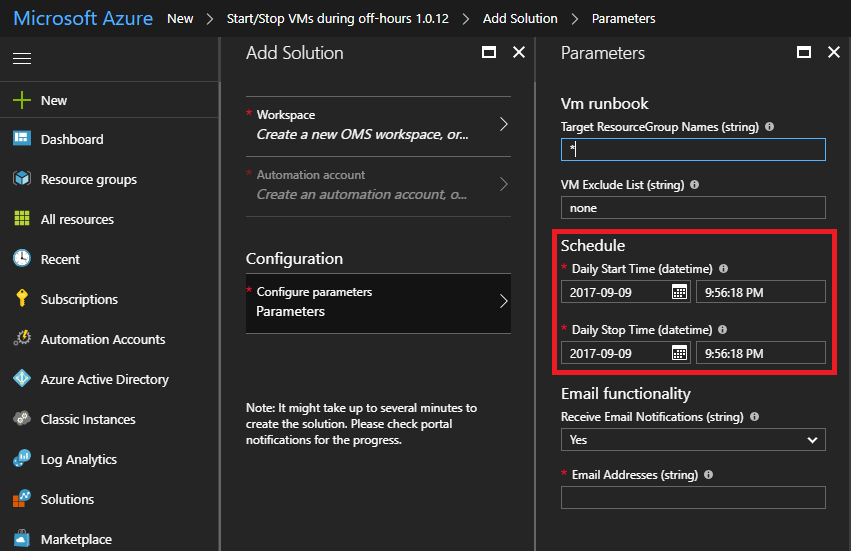
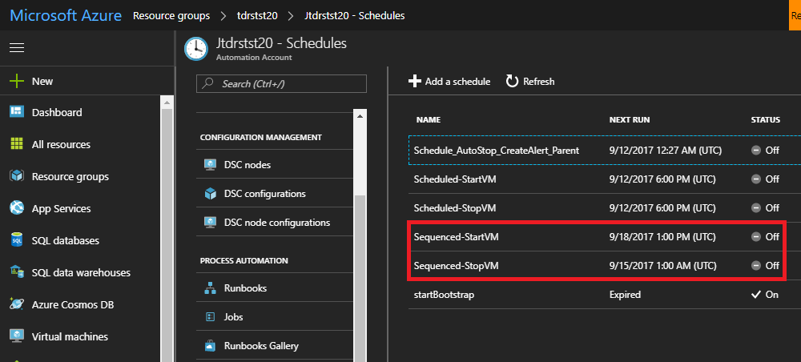
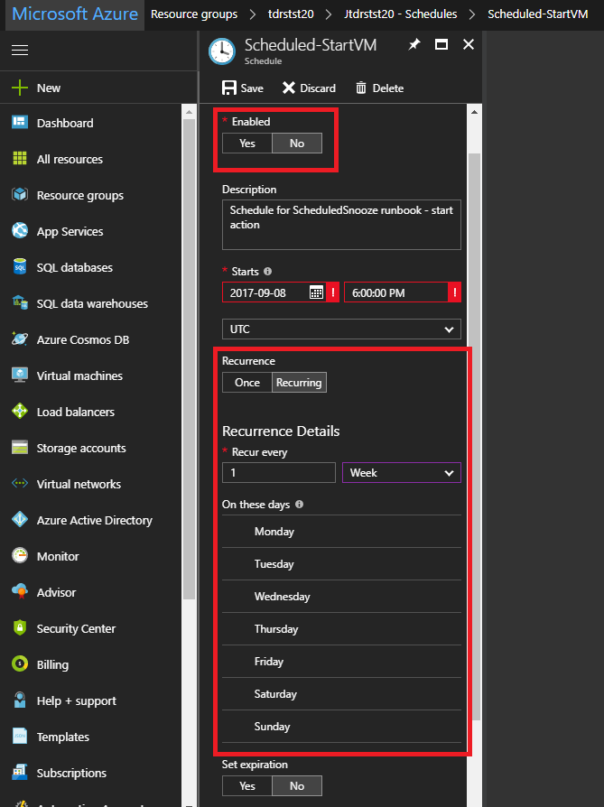

# **Start/Stop VMs during off-hours solution in Azure Automation**
The Start/Stop VMs during off-hours solution starts and stops your Azure virtual machines on user-defined schedules, provides insights through OMS Log Analytics, and sends optional emails by leveraging <a href="https://azuremarketplace.microsoft.com/en-us/marketplace/apps/SendGrid.SendGrid?tab=Overview" target="target">SendGrid</a>.  Supports both ARM and classic VMs for most scenarios.

***Objective:*** Provide decentralized automation capabilities for customers who want to reduce their costs leveraging serverless, low cost resources.  Features include: 
1.  Schedule VMs to start/stop  
2.  Schedule VMs to start/stop in ascending order using Azure Tags (no classic VM support)
3.  Auto stop VMs based on low CPU

***Prerequisites:*** 
* The runbooks work with an Azure Run As account. The Run As account is the preferred authentication method since it uses certificate authentication instead of a password that may expire or change frequently. 
* This solution can only manage VMs that are in the same subscription as where the Automation account resides. 
* This solution only deploys to the following Azure regions - Australia Southeast, Canada Central, Central India, East US, Japan East, Southeast Asia, UK South, West Central US, and West Europe. * The runbooks that manage the VM schedule can target VMs in any region. 
* To send email notifications when the start and stop VM runbooks complete, you must select select "Yes" to deploy SendGrid during deployment from Azure Marketplace.  SendGrid is a third party resource, for support on SendGrid operations please contact <a href="https://sendgrid.com/contact/" target="target">SendGrid</a>.

To use this solution, you only need to be familiar with four things:
1.  <a href="https://docs.microsoft.com/en-us/azure/automation/automation-schedules" target="target">Scheduling a runbook in Azure Automation</a> 

2.  <a href="https://docs.microsoft.com/en-us/azure/automation/automation-variables" target="target">Updating a variable in Azure Automation</a> 

3.  Starting a runbook and reading its output

4.  Viewing a chart in OMS

# **Overview**
The deployed Azure Automation account comes with preconfigured runbooks, schedules, and Log Analytics that allow you to tailor start/stop of VMs to suit your business needs. 

Across all scenarios, the “External_Start_ResourceGroupNames”, “External_Stop_ResourceGroupNames”, and “External_ExcludeVMNames” variables are necessary for targeting VMs with the exception of providing a comma separated list of VMs for the "AutoStop_CreateAlert_Parent" runbook.  That is, your VMs must reside in targeted resource groups for start/stop actions to happen.  The logic works a bit like Azure policy in that you can target at the subscription or resource group and have actions inherit even to newly created VMs.  The goal of this approach is to avoid having to maintain a schedule for every VM and manage VM start/stop in a bulk fashion.

The “WhatIf” parameter is present across all parent runbooks.  We recommend executing parent runbooks with the "WhatIf" parameter set to "True", validating in the output of the runbook that the correct VMs are being targeted, and only then executing a runbook with the “WhatIf” parameter set to "False".  Once this parameter is set to "False", impactful actions will likely take effect.  

Let’s go over a few common scenarios to get started.

<h2>Scenario #1: Daily stop/start VMs across a subscription or target resource groups (Enabled by default)</h2>

For example, stop all the VMs across a subscription in the evening when you leave work and start them in the morning when you are back in the office. When you configure the below two options during deployment you are creating a daily Azure Automation Schedules (“Scheduled-StartVM” and “Scheduled-StopVM”) that will start and stop targeted VMs.   

Note, the time zone is your current time zone when you configure the below parameter, but stored as UTC in the Azure Automation Schedules (“Scheduled-StartVM” and “Scheduled-StopVM”).  You do not have to do any time zone conversion as this is handled during the deployment. 

You control which VMs are in scope by configuring these two variables: 

which are then stored as “External_Start_ResourceGroupNames”, “External_Stop_ResourceGroupNames”, and “External_ExcludeVMNames” in Azure Automation variables.  Note, the "Target ResourceGroup Names" parameter is stored as the value for both “External_Start_ResourceGroupNames” and “External_Stop_ResourceGroupNames” variables.  For further granularity, you can modify each of these variables in the Azure automation account to target different resource groups for start action use “External_Start_ResourceGroupNames” and for stop action use “External_Stop_ResourceGroupNames”.  New VMs are automatically added to the start and stop schedules.

***Reminder:*** Execute the “ScheduledStartStop_Parent” runbook with the action variable set to either “start” or “stop” and the "WhatIf" variable set to "True" initially.  This will allow you to preview that action that would take place.  Once you are comfortable with the targeted VMs, then you can execute the runbook with "WhatIf" variable set to "False" or let the Azure Automation Schedules (“Scheduled-StartVM” and “Scheduled-StopVM”) run.

***Pro Tip:*** To customize which days of the week this takes effect edit the schedule in the Azure automation account.  

<h2>Scenario #2: Sequence the stop/start VMs across a subscription by using tags</h2>

For example, you’d like to stop the web servers first, stop a secondary SQL server, and the stop the primary SQL server in an deployed environment and then reverse the order for the start action.  You can accomplish this adding a “SequenceStart” tag and “SequenceStop” tag with a positive integer value to VMs across your subscription that are targeted in “External_Start_ResourceGroupNames” and “External_Stop_ResourceGroupNames” variables.  The start and stop actions will be performed in ascending order.  

Next, go into Schedules and find "Sequenced-StartVM" and "Sequenced-StopVM". 

Update the days and times to suit your needs and enable the schedule.

***Reminder*** It's a good practice to execute the “SequencedStartStop_Parent” runbook with the "action" variable set to either “start” or “stop” and the "whatif" variable set to "True" to preview changes. 

***Note:*** As Azure Tags are not supported on Classic VMs, this solution does not support Classic VMs. 

<h2>Scenario #3: Auto stop/start VMs across a subscription based on CPU utilization</h2>

For example, you’d like to start up your VMs in the morning, and then in the evening stop the ones that aren’t being used.  

Enable one of the below based on your preference, but not both.  
* **Target stop action by subscription and resource group:**  Execute the “AutoStop_CreateAlert_Parent” runbook with the action variable set to “start” and the "WhatIf" variable set to "True" to preview changes.   If the correct VMs are being targeted by the values you defined in “External_Stop_ResourceGroupNames”, “External_ExcludeVMNames”, and “External_ExcludeVMNames” in Azure Automation variables, enable/update the "Schedule_AutoStop_CreateAlert_Parent" schedule.

* **Target stop action by VM list:**  Execute the “AutoStop_CreateAlert_Parent” runbook with the whatif variable set to True, add a comma separated list of VMs (VM1, VM2, VM3) in the “VMList” parameter.  This is the one scenario where it will not honor the “External_Start_ResourceGroupNames” and “External_Stop_ResourceGroupNames” variables.  Note, it will honor the “External_ExcludeVMNames” variable.  For this scenario, you will need to create you own Automation schedule.  For details, see <a href="https://docs.microsoft.com/en-us/azure/automation/automation-schedules" target="target">scheduling a runbook in Azure Automation</a> 

Now that you have a schedule for stopping VMs based on CPU utilization, it's time to enable one of the below schedules to start them.  
* **Target start action by Subscription and Resource Group:**  See the steps in Scenario #1 for testing and enabling "Scheduled-StartVM" schedule.
* **Target start action by Subscription, Resource Group, and Tag:**  See the steps in Scenario #2 for testing and enabling "Sequenced-StartVM" schedule.

***Reminder*** Execute the appropriate runbooks with whatif variable set to True to preview changes. 

# **All about each Default Schedule**
This is a list of each of the Default Schedules which will be deployed with Azure Automation.   Modify these default schedules or create your own custom schedules.  By default each of these schedules are disabled except for "Scheduled_StartVM" and "Scheduled-StopVM".

It is not recommended to enable ALL schedules as there would an overlap on which schedule performs an action, rather it would be best to determine which optimizations you wish to perform and choose accordingly.  See the above Overview section for some example scenarios. 

**ScheduleName** | **Time and Frequency** | **What it does**
--- | --- | ---
Schedule_AutoStop_CreateAlert_Parent | Time of Deployment, Every 8 Hours | Runs the AutoStop_CreateAlert_Parent runbook every 8 hours, which in turn will stop VM’s based values in “External_Start_ResourceGroupNames”, “External_Stop_ResourceGroupNames”, and “External_ExcludeVMNames” in Azure Automation variables.  Alternatively, you can specify a comma separated list of VMs using the "VMList" parameter.  
Scheduled_StopVM | User Defined, Every Day | Runs the Scheduled_Parent runbook with a parameter of “Stop” every day at the given time.  Will Automatically stop all VM’s that meet the rules defined via Asset Variables.  Recommend enabling the sister schedule, Scheduled-StartVM.  
 Scheduled_StartVM | User Defined, Every Day | Runs the Scheduled_Parent runbook with a parameter of “Start” every day at the given time.  Will Automatically start all VM’s that meet the rules defined via Asset Variables.  Recommend enabling the sister schedule, Scheduled-StopVM.
 Sequenced-StopVM | 1:00AM (UTC), Every Friday | Runs the Sequenced_Parent runbook with a parameter of “Stop” every Friday at the given time.  Will sequentially (ascending) stop all VM’s with a tag of “SequenceStop” defined and part of appropriate Asset Variables.  Refer to Runbooks section for more details on tag values and asset variables.  Recommend enabling the sister schedule, Sequenced-StartVM.
 Sequenced-StartVM | 1:00PM (UTC), Every Monday | Runs the Sequenced_Parent runbook with a parameter of “Start” Every Monday at the given time.  Will sequentially (descending) start all VM’s with a tag of “SequenceStart” defined and part of appropriate Asset Variables.  Refer to Runbooks section for more details on tag values and asset variables.  Recommend enabling the sister schedule, Sequenced-StopVM.

# **All about each Runbook**

This is a list of runbooks that will be deployed with Azure Automation.  It is not recommended that you make changes to the runbook code, but rather write your own runbook for new functionality.

***Pro Tip:*** Don’t directly run any runbook with the name “Child” appended to the end.

  **Runbook Name** | **Parameters** | **What it does**
  --- | --- | ---
  AutoStop\_CreateAlert\_Child | VMObject   AlertAction   WebHookURI | Called from the parent runbook only. Creates alerts on per resource basis for AutoStop scenario.
  AutoStop\_CreateAlert\_Parent | WhatIf: True or False.   VMList | Creates or updates azure alert rules on VMs in the targeted subscription or resource groups.   WhatIf: True -> Runbook output will tell you which resources will be targeted.   WhatIf: False -> Create or update the alert rules.   VMList -> Comma separated list of VMs.  For example, "vm1,vm2,vm3"
  AutoStop\_Disable | none | Disable AutoStop alerts and default schedule.
  AutoStop\_StopVM\_Child | WebHookData | Called from parent runbook only. Alert rules call this runbook and it does the work of stopping the VM.
  Bootstrap\_Main | none | Used one time to set-up bootstrap configurations such as webhookURI which is typically not accessible from ARM. This runbook will be removed automatically if deployment has gone successfully.
   ScheduledStartStop\_Child | VMName:   Action: Stop or Start   ResourceGroupName: | Called from parent runbook only. Does the actual execution of stop or start for scheduled Stop.
  ScheduledStartStop\_Parent | Action: Stop or Start   WhatIF: True or False | This will take effect on all VMs in the subscription unless you edit the “External_Start_ResourceGroupNames” and “External_Stop_ResourceGroupNames”  which will restrict it to only execute on these target resource groups. You can also exclude specific VMs by updating the “External\_ExcludeVMNames” variable. WhatIf behaves the same as in other runbooks.
  SequencedStartStop\_Parent | Action: Stop or Start   WhatIf:  True or False | Create a tag called “SequenceStart” and another tag called "SequenceStop" on each VM that you want to sequence start\\stop activity for. The value of the tag should be an positive integer (1,2,3) that corresponds to the order you want to start\\stop in ascending order. WhatIf behaves the same as in other runbooks.    **Note: VMs must be within resource groups defined “External_Start_ResourceGroupNames”, “External_Stop_ResourceGroupNames”, and “External_ExcludeVMNames” in Azure Automation variables and have the appropriate tags for actions to take effect.**

# **All about each Variable**

This is a list of variables that will be deployed with Azure Automation.  

***Pro Tip:*** Only change variables prefixed with "External".  Do not change variables prefixed with "Internal"

  **Variable Name** | **Description** 
  --- | --- 
  External\_AutoStop\_Condition | This is the conditional operator required for configuring the condition before triggering an alert. Possible values are [GreaterThan, GreaterThanOrEqual, LessThan, LessThanOrEqual].
  External\_AutoStop\_Description | Alert to stop the VM if the CPU % exceed the threshold.
  External\_AutoStop\_MetricName | Name of the metric the Azure Alert rule is to be configured for.
  External\_AutoStop\_Threshold | Threshold for the Azure Alert rule. Possible percentage values ranging from 1 to 100.
  External\_AutoStop\_TimeAggregationOperator | The time aggregation operator which will be applied to the selected window size to evaluate the condition. Possible values are [Average, Minimum, Maximum, Total, Last].
  External\_AutoStop\_TimeWindow | The window size over which Azure will analyze selected metric for triggering an alert. This parameter accepts input in timespan format. Possible values are from 5 mins to 6 hours.
  External\_EmailFromAddress | Enter the sender of the email.
  External\_EmailSubject | Email subject text (title).
  External\_EmailToAddress | Enter the recipient of the email.  Seperate names by using comma(,).
  External\_ExcludeVMNames | Excluded VMs as comma separated list: vm1,vm2,vm3
  External\_IsSendEmail | Option to send email (Yes) or not send email (No). This option should be 'No' if you did not create SendGrid during the initial deployment.
  External\_Start\_ResourceGroupNames | Resource groups (as comma separated) targeted for Start actions: rg1,rg2,rg3
  External\_Stop\_ResourceGroupNames | Resource groups (as comma separated) targeted for Stop actions: rg1,rg2,rg3
  Internal\_AutomationAccountName | Azure Automation Account Name.
  Internal\_AutoSnooze_WebhookUri | Webhook URI called for the AutoStop scenario.
  Internal\_AzureSubscriptionId | Azure Subscription Id.
  Internal\_ResourceGroupName | Azure Automation Account resource group name.
  Internal\_SendGridAccountName | SendGrid Account Name.
  Internal\_SendGridPassword | SendGrid Password.

# **Configuring e-mail notifications**
 You must select “Yes” to “Receive Email Nonfictions” parameter during the initial deployment for e-mail notification or you will need to re-deploy the Start/Stop VMs during off-hours solution again from Azure marketplace.  
 
Three Azure automation variables control email:
1.	External_EmailFromAddress -> sender email address
2.  External_EmailToAddress -> comma separated list of emails (user@hotmail.com, user@outlook.com) to receive notification emails
3.	External_IsSendEmail -> Yes to receive emails, No to not receive emails

SendGrid Limitations:
1.  Maximum of one SendGrid account per user per subscription
2.  Maximum of two SendGrid accounts per subscription
3.  SendGrid is a third party resource, for support on SendGrid operations please contact <a href="https://sendgrid.com/contact/" target="target">SendGrid</a>.

